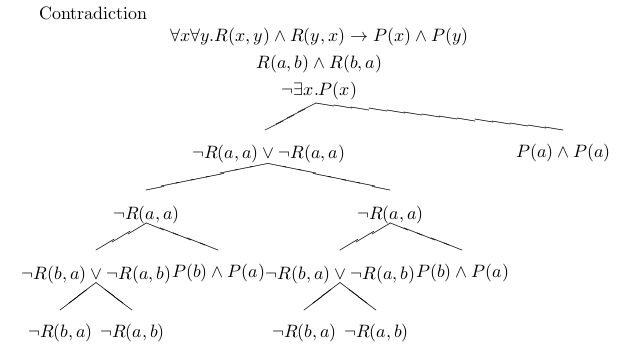
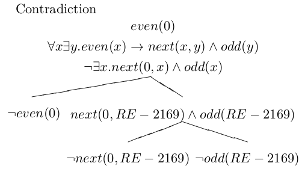
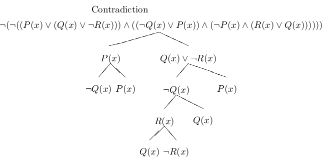

lexpr
=====

タブロー法で述語論理の式集合に対して充足可能性を判定します  

タブロー木をTeXに出力できます

例1



例2




実装上の都合により、自由変数と定数の区別がないので

(量化子のスコープにある自由変数は普通に束縛される)

例えばP(x)はxを個体定数として引数を1つとる述語(命題)と認識されます.

なので綺麗ではないですが、命題論理の範囲の式の恒真性のチェックもできます

[Wikipediaの例](http://ja.wikipedia.org/wiki/DPLL%E3%82%A2%E3%83%AB%E3%82%B4%E3%83%AA%E3%82%BA%E3%83%A0#.E5.85.85.E8.B6.B3.E4.B8.8D.E8.83.BD.E3.81.AA.E8.AB.96.E7.90.86.E5.BC.8F)




Usage
=====

inferパッケージのsemantic-conseqに前提となる式集合と  
  
結論となる式を与えると、意味論的帰結となるかどうかを調べます

TESTER.lispがサンプルになっているので

動かしてみるとどんな感じになるかわかります

main.lisp でインタラクティブに定理証明ができます

```使い方
$ sbcl --script main.lisp 
Theorem Prover Beta 0.9
Input set of wff { 
? Ax.(human(x) > mammal(x))
inputted: ∀x.human(x)⊃mammal(x)
? Ax.(mammal(x) > creature(x))
inputted: ∀x.mammal(x)⊃creature(x)
? Ax.(creature(x) > mortal(x))
inputted: ∀x.creature(x)⊃mortal(x)
? }
conseq ? ~Ex.(human(x) & ~mortal(x))
inputted: ¬∃x.human(x)∧¬mortal(x)
processing...

{∀x.creature(x)⊃mortal(x) , 
 ∀x.mammal(x)⊃creature(x) , 
 ∀x.human(x)⊃mammal(x) , 
 ¬(¬∃x.human(x)∧¬mortal(x)) , } is contradiction
```

矛盾(contradiction)になれば意味論的帰結となることが言えます

逆に充足可能(satisfiable)な状態で停止することは少ないです...

演算子は以下の通りです

全称量化: A
存在量化: E
否定: ~
含意: >
連言: &
選言: V
同値: -


```使用可能な一階述語論理の式の形式的定義
	<VAR>        ::= <LISP-SYMBOL>
	<PRED-SYM>   ::= <LISP-SYMBOL>	
	<OPERATOR>   ::= > | & | V | ~ | -
	
	<QUANTIFIER> ::= A | E
	<QUANTS>     ::= <QUANTIFIER> <VAR>
	<QUANTS-PART>::= <QUANTS>+ "."

	<ATOMIC>     ::= <PRED-SYM> "(" <VAR>+ ")"
	<EXPR>       ::= 
		<ATOMIC> | "(" <EXPR> <OPERATOR> <EXPR> ")" | <QUANTS-PART> <EXPR> 
```
